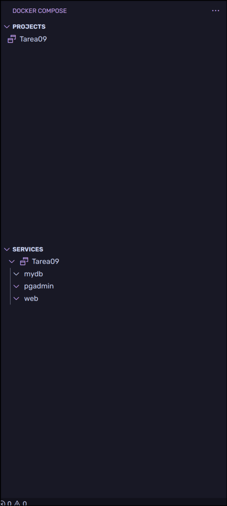
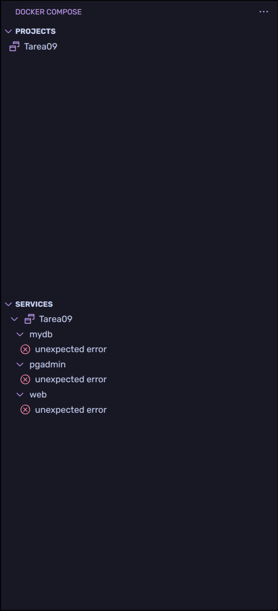

# Tarea 11

Bien primero debemos crear un [docker compose](docker-compose.yml) y un archivo [.env](.env)

En mi caso voy a usar estos archivos de ejemplo, para manejar todo el asunto de docker instale las siguientes extensiones para `VSCode`

## Extensiones VSCode
- Container tools
La extension que Visual Studio Code recomienda para el tema de manejar los contenedores

Como se puede ver esta extension nos muestra los contenedores en ejecucion e informacion sobre ellos, como por ejemplo acceso al sistema de archivos, además de que si el VSCode ya te recomienda instalar automaticamente extensiones recomendadas para todo lo contenedores en cuanto abres cosas como un dockerfile o un docker compose ya tu sugiere instalar

Además de eso tambien meti una de docker compose, que me permite por ejemplo ver una lista con los servicios de forma o

Ademas si hay fallo al correr los contendores

## Instalacion de Odoo

